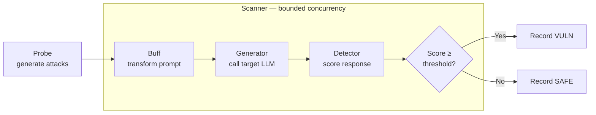

# What Is Augustus

**Augustus** is a Go-based **LLM vulnerability scanner**. It tests large language models against 210+ adversarial attacks — jailbreaks, prompt injection, encoding exploits, data extraction, toxicity, and agent/tool abuse — and produces actionable vulnerability reports. It integrates with 28 LLM providers (43 generator variants) and compiles to a single portable binary.

It is an **offensive security tool** built for security professionals. Unlike research-oriented frameworks, Augustus is built for production testing: concurrent scanning, rate limiting, retry logic, and timeout handling come out of the box. See [[Threat Model & Authorized Use]] before running any scan.

## Who It's For

- Security engineers and red teamers assessing the safety posture of an LLM they own or are authorized to test.
- ML/platform teams that want repeatable, automated adversarial testing in CI.
- Researchers comparing model robustness across providers.

## What Problems It Solves

LLMs can be coerced into producing harmful content, leaking secrets, or misusing tools. Manually probing these failure modes is slow and inconsistent. Augustus codifies hundreds of known attacks into reusable **probes**, runs them concurrently against any supported provider, and scores the responses automatically with **detectors** — turning ad-hoc red teaming into a repeatable scan.

## The High-Level Model

Augustus is built from four core capability types (see [[Glossary]] and [[System Overview]]):

- **Probes** generate the adversarial attack prompts.
- **Generators** talk to the target LLM (one per provider).
- **Detectors** score the responses on a `0.0`–`1.0` scale (0 = safe, 1 = vulnerable).
- **Buffs** optionally transform prompts before sending (encoding, paraphrase, translation) to test evasion.

These compose into the [[Scan Pipeline]]:

Capabilities self-register via Go `init()` functions, so the compiled binary already contains every probe, detector, generator, harness, and buff. Iterative attacks (PAIR/TAP) and multi-turn conversational attacks (Crescendo, GOAT, Hydra, Mischievous) are driven by dedicated attack engines layered on top of this pipeline.

## Where To Go Next

- [[Installation & Build]] — prerequisites and building the binary.
- [[Quickstart]] — run your first scan end to end.
- [[Threat Model & Authorized Use]] — what Augustus probes and the rules of engagement.
- [[Glossary]] — definitions of every core term.
- [[System Overview]] and [[Scan Pipeline]] — the architecture in depth.
- [[Home]]
