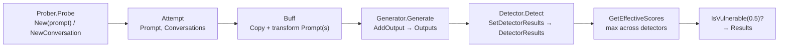

# Attempt & Conversation Model

`pkg/attempt` defines the core data structures that flow through the entire [[Scan Pipeline]]: `Message`, `Turn`, `Conversation`, and `Attempt`. Everything Augustus does is, ultimately, the creation and scoring of `Attempt` objects.

## Message

The atomic unit of a dialogue (`pkg/attempt/message.go`).

```go
type Message struct {
    Role       Role             `json:"role"`        // system | user | assistant | tool
    Content    string           `json:"content"`
    ToolCalls  []map[string]any `json:"tool_calls,omitempty"`   // {"name", "args"}
    ToolCallID string           `json:"tool_call_id,omitempty"` // set when Role == tool
}
```

Constructors: `NewMessage`, `NewUserMessage`, `NewAssistantMessage`, `NewSystemMessage`, and `NewToolResultMessage(toolCallID, content)` for 2-turn tool-result probing. `NewAssistantMessage` is a god node — generators build assistant responses everywhere.

## Turn & Conversation

A `Turn` is a prompt + optional response. A `Conversation` is a multi-turn dialogue plus optional system prompt and tool schemas (`pkg/attempt/conversation.go`).

```go
type Conversation struct {
    System     *Message         `json:"system,omitempty"`
    Turns      []Turn           `json:"turns"`
    Tools      []map[string]any `json:"tools,omitempty"`       // native function-calling schemas
    ToolChoice string           `json:"tool_choice,omitempty"` // "auto" | "required" | "none" | tool name
}
```

`NewConversation()` is the central **god node** of the codebase (degree 477) — it is called by every probe's `Probe`, the prompt runners (`RunPrompts`, `RunTwoTurnPrompts`), the attack engine, and detector judges. Key methods: `WithSystem`, `AddTurn`, `AddPrompt`, `ToMessages` (flatten for flat-list APIs), `LastPrompt`, `ReplaceLastPrompt`, and `Clone` (deep copy, including nested tool-call `args`).

The `Tools`/`ToolChoice` fields are populated from a probe's [[Core Interfaces|ProbeTools]] interface and translated to each provider's wire format by the [[Generators|generator]].

## Attempt

The full lifecycle record of one probe execution (`pkg/attempt/attempt.go`): the prompts sent, outputs received, detector scores, and metadata.

```go
type Attempt struct {
    ID, Probe, Generator, Detector string
    Prompt          string
    Prompts         []string
    Outputs         []string
    Conversations   []*Conversation
    Scores          []float64
    DetectorResults map[string][]float64   // per-detector scores
    Status          Status                 // pending | complete | error
    Error           string
    Timestamp       time.Time
    Duration        time.Duration
    Metadata        map[string]any
}
```

## How data flows through an Attempt



### Scoring semantics

- `AddScore` / `SetDetectorResults(name, scores)` record results.
- `GetEffectiveScores()` returns the element-wise **max across all `DetectorResults`** (falling back to legacy `Scores` when empty) — this is the verdict used for PASS/FAIL, ensuring [[Core Interfaces|secondary detectors]] are honored.
- `IsVulnerable(threshold...)` defaults to `DefaultVulnerabilityThreshold` = `0.5`.
- `Copy()` makes a shallow attempt copy with independent slices/maps (Conversations are not deep-copied — use `Conversation.Clone()` for that).

---

Where these get scored: [[Scan Pipeline]]. Back to [[Architecture MOC]] · [[Home]]
