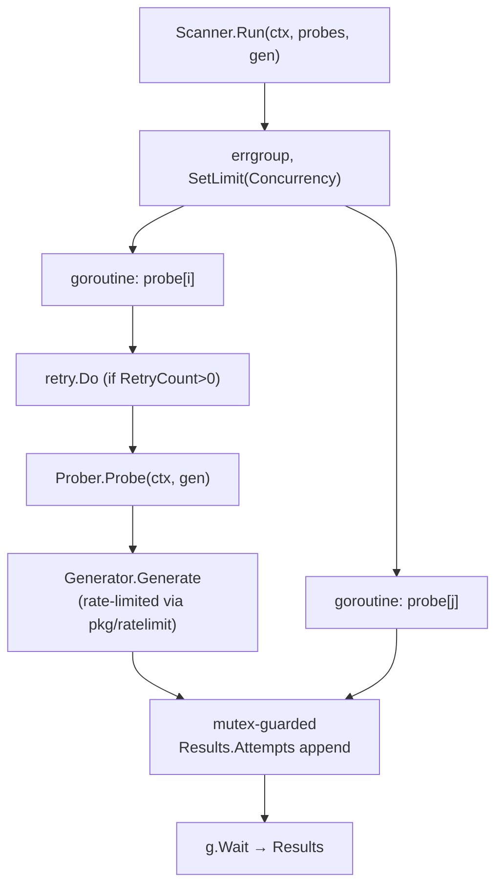

# Concurrency & Scanner

`pkg/scanner` orchestrates probe execution. The `Scanner.Run` method runs every selected [[Probes|prober]] concurrently against one [[Generators|generator]] under a bounded `errgroup`, collecting `Attempt`s into aggregated `Results`.

## Bounded concurrency with errgroup

`Scanner.Run(ctx, probes, gen) Results` (`pkg/scanner/scanner.go`) creates an `errgroup.WithContext` and caps in-flight goroutines with `g.SetLimit(opts.Concurrency)`:

```go
g, gctx := errgroup.WithContext(ctx)
g.SetLimit(s.opts.Concurrency) // default 10

for _, probe := range probes {
    probe := probe
    g.Go(func() error {
        // per-probe timeout, retry, Probe(ctx, gen), record results
        return nil // returns nil so one probe failure doesn't cancel the rest
    })
}
g.Wait()
```

Each goroutine returns `nil` on probe failure so a single failing probe does not cancel the whole group; only context cancellation/timeout propagates an error that stops other probes. Results are collected under a `sync.Mutex`; metrics are updated under a separate `metricsMu` mutex (exposed via `GetMetricsMutex()` for the Prometheus exporter). A progress callback (`SetProgressCallback`) fires after each probe, outside the locks.

## Scanner Options

`scanner.Options` (`pkg/scanner/options.go`) configures behavior; `DefaultOptions()` provides sensible defaults:

| Field | Default | Meaning |
|---|---|---|
| `Concurrency` | `10` | Max probes running in parallel (`errgroup` limit) |
| `Timeout` | `0` (none) | Overall timeout for the whole run |
| `ProbeTimeout` | `0` (none) | Per-probe timeout |
| `RetryCount` | `0` | Retries per failed probe |
| `RetryBackoff` | `1s` | Base delay between retries |
| `Metrics` | `nil` | Optional `*metrics.Metrics` tracker |

## Retry integration

When `RetryCount > 0`, each probe is wrapped in `retry.Do` (`pkg/retry`) with a `retry.Config`: `MaxAttempts = RetryCount`, `InitialDelay = RetryBackoff`, `MaxDelay = RetryBackoff * 10`, linear `Multiplier = 1.0`, and `Jitter = 0.1` (10% jitter to avoid thundering herd). `pkg/retry` itself supports exponential backoff with jitter; the scanner currently configures it for linear backoff.

## Rate limiting

Rate limiting is applied at the [[Generators|generator]] layer, not the scanner. `pkg/ratelimit` provides a token-bucket limiter; generators created with a `rate_limit` (requests/sec) throttle their own API calls, so concurrency at the scanner and per-provider throughput are controlled independently.

## Execution overview



---

The stages each goroutine runs: [[Scan Pipeline]]. Defaults come from [[Configuration System]]. Back to [[Architecture MOC]] · [[Home]]
