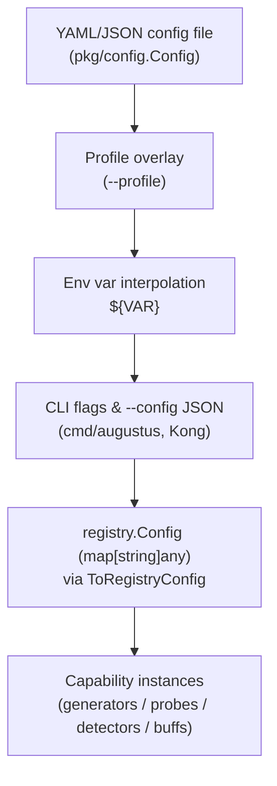

# Configuration System

`pkg/config` loads and validates Augustus configuration from YAML/JSON files, supports named profiles, and interpolates environment variables. The Kong-based CLI in `cmd/augustus` layers command-line flags and `--config` JSON on top, then hands typed config down to the [[Plugin Registration & Registries|registries]] as `registry.Config` maps.

## The Config struct

`config.Config` (`pkg/config/config.go`) mirrors the full configuration file. Fields carry both `yaml` and `koanf` tags (the koanf loader lives in `koanf_loader.go`):

```go
type Config struct {
    Run        RunConfig                  // runtime: max_attempts, timeout, concurrency, probe_timeout
    Generators map[string]GeneratorConfig // per-generator settings
    Judge      JudgeGlobalConfig          // default LLM judge inherited by PAIR/TAP probes & judge detectors
    Probes     ProbeConfig
    Detectors  DetectorConfig
    Buffs      BuffConfig
    Hooks      HooksConfig                // setup / prepare / cleanup shell commands
    Output     OutputConfig
    Profiles   map[string]Profile         // named overlays
}
```

`RunConfig` maps onto [[Concurrency & Scanner|scanner.Options]]: `concurrency`, `timeout`, `probe_timeout`, `max_attempts`. Several fields carry `validate` tags (e.g. `temperature` is `gte=0,lte=2`, `concurrency` is `gte=0`).

## Loading and profiles

- `LoadConfig` / `LoadConfigWithProfile` (`pkg/config/loader.go`) read a file, apply a named `Profile` overlay if requested, and interpolate `${ENV_VAR}` references via `interpolateEnvVars` / `interpolateConfigEnvVars`.
- `LoadConfigKoanf` (`pkg/config/koanf_loader.go`) is the koanf-based loader supporting nested env vars and profile merging.
- A `Profile` overlays any subset of sections (run/generators/judge/probes/detectors/buffs/hooks/output) on top of the base config — e.g. a `ci` profile that lowers concurrency.

## Generator config → registry.Config

`GeneratorConfig` holds typed fields (`model`, `temperature`, `api_key`, `rate_limit`) plus an inline `Extra map[string]any` (`yaml:",inline"` / `koanf:",remain"`) capturing provider-specific keys. `ToRegistryConfig()` flattens it into a `map[string]any` where `Extra` overrides typed fields, producing the `registry.Config` consumed by a generator factory:

```go
func (g GeneratorConfig) ToRegistryConfig() map[string]any {
    // layer 1: model, temperature, api_key, rate_limit
    // layer 2: Extra (overrides layer 1)
}
```

This is the bridge to [[Plugin Registration & Registries]]: file config → `ToRegistryConfig()` → `registry.Config` → `registry.FromMap` parser → typed struct → instance.

## Configuration sources (precedence)



## CLI usage

```bash
# Direct provider + probe + detector
augustus scan openai.OpenAI --probe dan.Dan_11_0 --detector dan.DAN

# Glob batch selection
augustus scan anthropic.Anthropic --probes-glob "dan.*,goodside.*"

# Inline registry.Config as JSON for a custom REST endpoint
augustus scan rest.Rest --probe dan.Dan_11_0 --config '{"uri":"https://api.example.com/v1/chat"}'
```

---

How config drives execution: [[Concurrency & Scanner]] and [[Scan Pipeline]]. Back to [[Architecture MOC]] · [[Home]]
