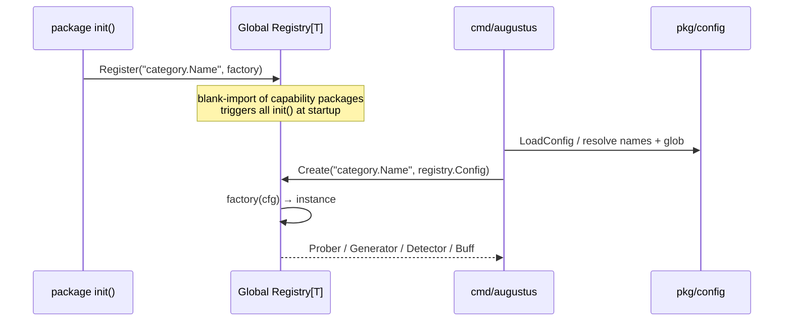

# Plugin Registration & Registries

Augustus uses a factory + self-registration pattern so capabilities are modular and discoverable without a central wiring file. Each capability registers itself in an `init()` function; the CLI/config then instantiates capabilities by name from a global registry.

## The pattern

Each capability package calls `Register` from its `init()`:

```go
// internal/probes/dan/templates.go
func init() {
    probes.Register("dan.Dan_11_0", func(_ registry.Config) (probes.Prober, error) {
        return &DanProbe{}, nil
    })
}
```

Names are fully qualified: `category.Name` (e.g., `dan.Dan_11_0`, `openai.OpenAI`, `always.Pass`, `encoding.Base64`).

## Global registries

Each `pkg/` family exposes a global registry plus `Register` / `Get` / `Create` / `List` helpers:

- `probes.Registry`
- `generators.Registry`
- `detectors.Registry`
- `buffs.Registry`

Under the hood these are `registry.New[T](name)` instances (`pkg/registry/registry.go`), a generic, mutex-protected `Registry[T]` mapping names to `func(Config) (T, error)` factories. Useful methods: `Register`, `Get`, `Create`, `List` (sorted), `Has`, `Count`, `Name`.

## Typed configuration

`registry.Config` is `map[string]any`. To get compile-time-safe typed configs while still accepting YAML/JSON maps, factories are written against a typed struct and adapted with `registry.FromMap`:

```go
func FromMap[C any, T any](
    factory TypedFactory[C, T],
    parser  func(Config) (C, error),
) func(Config) (T, error)
```

```go
typedFactory := func(cfg OpenAIConfig) (*OpenAI, error) { ... }
parser       := func(m registry.Config) (OpenAIConfig, error) { ... }
generators.Register("openai.OpenAI", registry.FromMap(typedFactory, parser))
```

For capabilities that take no config, use `registry.FromMapNoConfig(factory)` with the `registry.NoConfig` marker type.

## Registration → instantiation flow



`registry.ErrNotFound` is returned by `Create` when a name is not registered.

---

The interfaces these factories produce: [[Core Interfaces]]. Config sources: [[Configuration System]]. Back to [[Architecture MOC]] · [[Home]]
