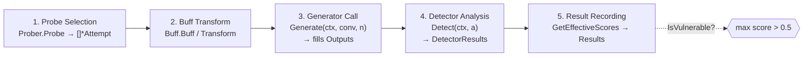

# Scan Pipeline

A scan is a five-stage flow. The unit of work is the [[Attempt & Conversation Model|Attempt]], which is created, mutated, and scored as it moves through the stages. The [[Concurrency & Scanner|Scanner]] runs each probe in this pipeline concurrently under a bounded `errgroup`.

## The five stages

1. **Probe Selection** — the CLI/config resolves probe names (exact or glob) and instantiates [[Probes|probers]] from the registry. Each prober's `Probe(ctx, gen)` produces `[]*attempt.Attempt`.
2. **Buff Transform** — if any [[Buffs|buffs]] are configured, each attempt is expanded into transformed variants (encoding, translation, paraphrase) before it reaches the model. Buffs operate on the `Prompt`/`Prompts` fields and copy the attempt rather than mutating in place.
3. **Generator Call** — the [[Generators|generator]] sends the attempt's `Conversation` to the LLM via `Generate(ctx, conv, n)` and writes the model's responses into the attempt's `Outputs`.
4. **Detector Analysis** — one or more [[Detectors|detectors]] read the outputs via `Detect(ctx, a)` and return per-output scores in `[0.0, 1.0]`. Results are stored per detector in `Attempt.DetectorResults`. The verdict is the **element-wise max across all detectors** (`Attempt.GetEffectiveScores`), so a [[Core Interfaces|secondary detector]] hit alone marks the attempt vulnerable.
5. **Result Recording** — the scanner aggregates attempts into `scanner.Results` (counts of succeeded/failed, all attempts, errors) for reporting.

## Flow

## Notes on the verdict

`Attempt.GetEffectiveScores()` computes the element-wise maximum across every slice in `DetectorResults` (aligning from index 0, missing elements default to `0.0`). It falls back to the legacy `Scores` field when `DetectorResults` is empty. The default vulnerability threshold is `0.5` (`attempt.DefaultVulnerabilityThreshold`); `Attempt.IsVulnerable()` returns true when any score exceeds it.

Per-probe detector behavior (overrides and secondary detectors) is declared via the optional probe interfaces — see [[Core Interfaces]].

---

Concurrency, retry, and rate limiting: [[Concurrency & Scanner]]. Back to [[Architecture MOC]] · [[Home]]
