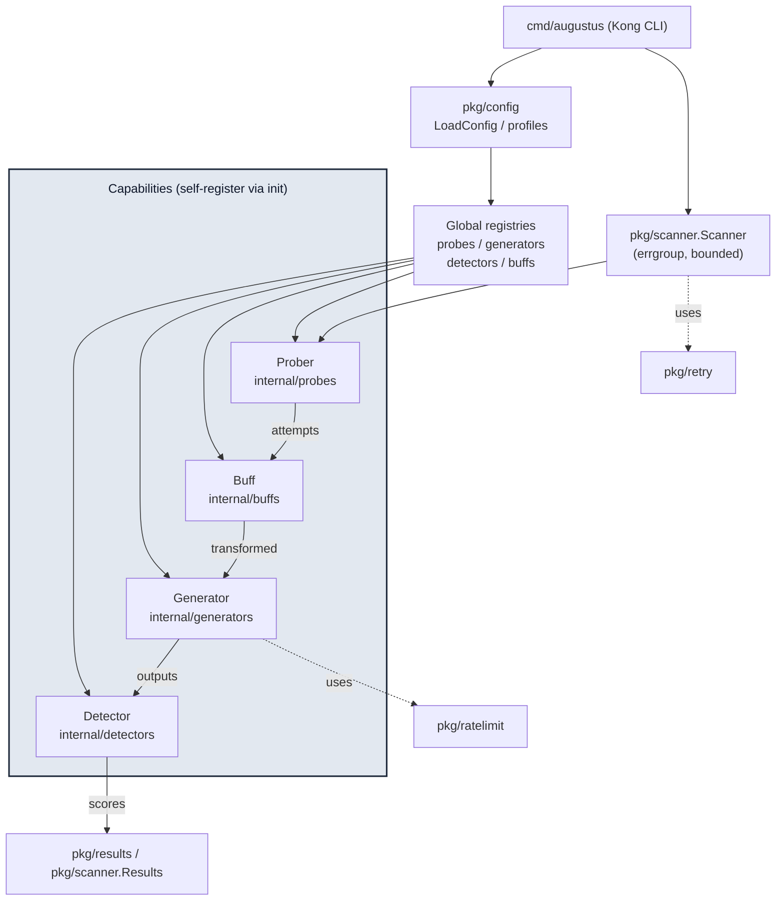

# System Overview

Augustus tests large language models against adversarial attacks. The design is deliberately plugin-shaped: four small interfaces ([[Core Interfaces]]) describe everything a capability can do, and concrete implementations self-register into global registries ([[Plugin Registration & Registries]]). A scan wires a chosen **probe**, optional **buffs**, a target **generator**, and one or more **detectors** together and runs them concurrently.

## The pieces

- **Probes** ([[Probes]]) — generate adversarial attack prompts and return `[]*attempt.Attempt`. 230+ implementations live under `internal/probes/`, organized by attack category. Many are defined as Nuclei-style YAML templates loaded by `pkg/templates`.
- **Generators** ([[Generators]]) — wrap an LLM provider's API behind a common interface. 28 providers (43 variants) live under `internal/generators/`.
- **Detectors** ([[Detectors]]) — analyze the model's outputs and assign a vulnerability score in `[0.0, 1.0]`. 95+ implementations under `internal/detectors/`.
- **Buffs** ([[Buffs]]) — transform prompts before they are sent (encoding, translation, paraphrase). 7 implementations under `internal/buffs/`.
- **Scanner** ([[Concurrency & Scanner]]) — `pkg/scanner` orchestrates probe execution with a bounded `errgroup`.
- **Attempt model** ([[Attempt & Conversation Model]]) — `pkg/attempt` holds the canonical `Attempt`, `Conversation`, and `Message` types that flow through every stage.
- **Configuration** ([[Configuration System]]) — `pkg/config` loads YAML/JSON config and profiles; the Kong-based CLI lives in `cmd/augustus`.

## Supporting infrastructure

- `internal/ahocorasick` — fast multi-keyword matching for string detectors
- `pkg/ratelimit` — token-bucket rate limiting per generator
- `pkg/retry` — exponential backoff with jitter
- `internal/attackengine` — iterative attack engine (PAIR / TAP)
- `internal/multiturn` — multi-turn conversation engine
- `pkg/harnesses`, `pkg/hooks` — scan harnesses and lifecycle hook commands

## How it fits together

The data object that threads through all of this is the [[Attempt & Conversation Model|Attempt]]: probes create it, buffs transform it, generators fill its `Outputs`, detectors fill its `Scores`, and the scanner aggregates it into `Results`.

---

See the full flow in [[Scan Pipeline]]. Back to [[Architecture MOC]] · [[Home]]
