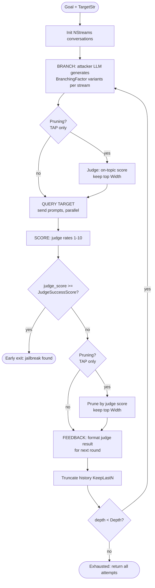

# Attack Engine (PAIR & TAP)

The **attack engine** (`internal/attackengine/`) implements iterative, *automated* single-turn jailbreaks. Instead of a fixed prompt, an **attacker LLM** refines its prompt over multiple rounds based on feedback from a **judge LLM** that scores how close the target's reply came to the forbidden goal. Both [[PAIR]] and [[TAP]] share the same `Engine`; they differ only in config presets.

The two probes are `pair.IterativePAIR` and `tap.IterativeTAP`. Both **require a judge generator** in addition to the target.

## The Loop

## How It Works

1. **Branch** — for each conversation stream, the attacker LLM produces `BranchingFactor` candidate prompts (returned as JSON with `prompt` + `improvement`; invalid JSON is retried up to `AttackMaxAttempts`).
2. **On-topic prune** (TAP only) — the judge filters off-topic candidates, keeping the top `Width`.
3. **Query target** — surviving prompts are sent to the target in parallel (`errgroup`, limit 10).
4. **Judge** — the judge LLM scores each response 1–10. A score is normalized to `[0,1]` (`/10`) and stored on the attempt.
5. **Early exit** — if any score ≥ `JudgeSuccessScore` (default 10), the engine returns immediately.
6. **Judge prune** (TAP only) — keep the top `Width` by judge score.
7. **Feedback + truncate** — the judge's verdict becomes the next-round prompt for the attacker; history is trimmed to `KeepLastN`.

Every candidate at every depth is recorded as an `attempt.Attempt`, including intermediate iterations.

## PAIR vs TAP (config presets)

| Param | PAIR | TAP |
|---|---|---|
| BranchingFactor | 1 | 4 |
| Depth | 20 | 10 |
| NStreams (parallel chats) | 3 | 1 |
| KeepLastN | 4 | 1 |
| Pruning (tree-of-attacks) | off | on |
| Width (retained after prune) | 10 | 10 |

**PAIR** runs several independent linear refinement chats. **TAP** ("Tree of Attacks with Pruning") branches each node into multiple children and aggressively prunes off-topic / low-scoring branches, exploring a tree rather than parallel lines.

## Related

- [[PAIR]]
- [[TAP]]
- [[Multi-turn Attacks]] (the conversational counterpart)
- [[Scoring & Verdicts]]
- [[Concepts MOC]] · [[Home]]
