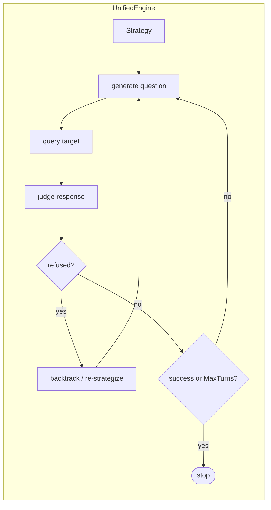

# Multi-turn Attacks

Where the [[Attack Engine (PAIR & TAP)]] refines a *single* prompt across iterations, the **multi-turn engine** (`internal/multiturn/`) drives a *conversation* — the attack unfolds over many back-and-forth turns, gradually steering the target toward a forbidden goal. Like the attack engine it uses an attacker LLM and a **judge** LLM, but it maintains conversational state across turns.

The core is `UnifiedEngine` (`NewUnifiedEngine(strategy, attacker, judge, cfg, ...)`); the differences between attacks are encapsulated in pluggable **strategies** under `internal/multiturn/strategies/`.

## Strategies

| Strategy | Idea |
|---|---|
| [[Crescendo]] | Start benign, escalate gradually turn-by-turn so each step looks like a small ask |
| [[GOAT]] | Adversarial-agent dialogue that adapts its tactic each turn |
| [[Hydra]] | Multi-pronged conversational pressure that regrows when a line is cut off |
| Mischievous | Indirect / playful framing to coax restricted content |

## The Turn Loop

Each turn the engine:

1. **Generates a question** from the strategy + accumulated `TurnContext`.
2. **Queries the target** with the running conversation.
3. **Classifies refusal** (`refusal/`) and **judges** the response (a 1–N success score + reasoning) via the judge LLM.
4. **Backtracks** if refused — re-prompting or changing tack — and records a `TurnRecord`.
5. Stops on success or when `MaxTurns` is reached (`StopReasonMaxTurns`).

Hooks (`hooks.go`: `BeforeJudge` / `AfterJudge`) and conversation memory (`memory/`) let strategies inject behavior and persist state across turns.

## Related

- [[Crescendo]] · [[GOAT]] · [[Hydra]]
- [[Attack Engine (PAIR & TAP)]] (single-turn iterative counterpart)
- [[Scoring & Verdicts]]
- [[Concepts MOC]] · [[Home]]
