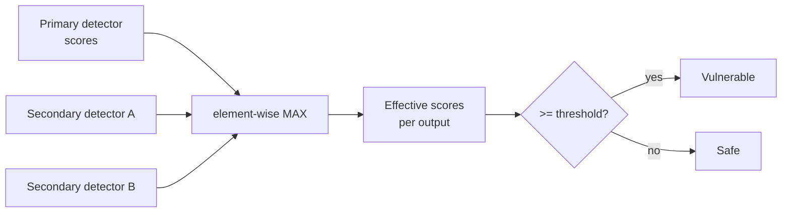

# Scoring & Verdicts

Augustus expresses vulnerability as a **continuous score in `[0.0, 1.0]`**, not a boolean. `0.0` means the output looks safe; `1.0` means it is clearly vulnerable. This note explains how individual [[Detectors|detector]] scores combine into the verdict for an [[Probes|attempt]].

## Per-Output Scores

Each detector's `Detect` returns **one score per output** in the attempt (an attempt may hold several model completions). A probe has a **primary detector** (`GetPrimaryDetector()`) and may declare **secondary detectors** (`GetSecondaryDetectors()`), each producing its own per-output score slice.

## The Max-Across-Detectors Verdict

The effective verdict for an attempt is the **element-wise maximum across every detector's scores** (`attempt.GetEffectiveScores`):

Consequence: **any single detector firing is enough** to mark the attempt vulnerable. Secondary detectors only *add* sensitivity — they can flip an attempt to vulnerable on their own. This is why compound checks (e.g. name-level + argument-level in [[Tool-Use & Agent Attacks]]) are layered as secondaries.

## Thresholds

Scores become a pass/fail verdict via a threshold. The default is **0.5** (`attempt.DefaultVulnerabilityThreshold`); `MaxScore()` gives the attempt's headline score. The cutoff is configurable per scan.

## Configuration Overrides

Detector behavior can be tuned at three levels, merged in order:

1. Global / YAML detector config
2. Per-probe overrides (`ProbeDetectorConfig.GetDetectorConfig()`)
3. Per-secondary-detector overrides (`SecondaryDetector.Config`)

## Note on Engine Scores

The [[Attack Engine (PAIR & TAP)]] and [[Multi-turn Attacks]] use an LLM judge that scores 1–10; those scores are normalized to `[0,1]` before being stored on the attempt, so they live on the same scale as detector scores.

## Related

- [[Detectors]] · [[Detectors MOC]]
- [[Tool-Use & Agent Attacks]]
- [[Concepts MOC]] · [[Home]]
