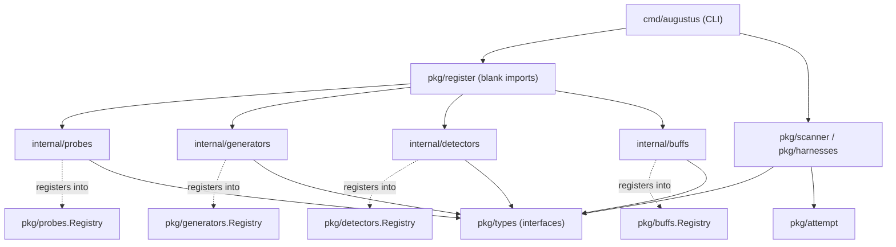

# Package Map (pkg vs internal)

Augustus follows Go's standard public/private package convention. The codebase splits into three top-level trees:

- **`cmd/augustus/`** — the executable entry point (Kong-based CLI). It wires flags to a scan run; it imports `pkg/` and the blank-import aggregators in `pkg/register/`.
- **`pkg/`** — the **public, importable** surface: canonical interfaces, shared utilities, the global registries, and the execution machinery.
- **`internal/`** — the **private implementation**. Go forbids importing `internal/` from outside the module, so every concrete probe, generator, detector, and buff lives here and is reachable only through the `pkg/` registries.

The dividing line is intent: `pkg/` defines *what a capability is* and *how the scan runs*; `internal/` defines *the 230+ concrete capabilities*. See [[Core Interfaces]] and [[Plugin Registration & Registries]] for the contracts that bridge the two.

## Entry point — `cmd/augustus/`

| File | Purpose |
|------|---------|
| `main.go` | Process entry; bootstraps the CLI |
| `cli.go` | Kong command/flag definitions |
| `scan.go` | The `scan` subcommand — builds and runs the scan pipeline |
| `common.go` | Shared CLI helpers |
| `banner.go` | Startup banner |

## Public packages — `pkg/`

| Package | Purpose |
|---------|---------|
| `types` | Canonical interface definitions: `Prober`, `Generator`, `Detector`, `Buff` (plus optional probe interfaces). See [[Core Interfaces]] |
| `registry` | Generic factory registration & discovery with typed configs (the engine behind every `*.Registry`) |
| `scanner` | Concurrent scan execution via `errgroup` (bounded goroutines) |
| `attempt` | The `Attempt` / `Conversation` / `Message` data model passed through the pipeline. See [[Attempt & Conversation Model]] |
| `templates` | YAML probe template loader (Nuclei-style) and the canonical `TemplateProbe` |
| `buffs` | `Buff` interface, base type, and buff chaining |
| `probes` | `Prober` plumbing: embed helpers, simple/run probe scaffolding |
| `detectors` | `Detector` interface façade |
| `generators` | `Generator` interface façade |
| `config` | Configuration loading/resolution (koanf-based) |
| `cli` | Shared CLI flag utilities |
| `results` | Result recording & output formats (JSONL, HTML, streaming) |
| `harnesses` | Harness interface orchestrating scans (probewise/agentwise/batch) + progress + detection phase |
| `hooks` | Lifecycle command hooks for stateful scanning |
| `lib` | Shared low-level libs: `lib/http` (shared HTTP client), `lib/stego` (steganography) |
| `logging` | Structured logging setup |
| `metrics` | Prometheus metrics |
| `prefilter` | Aho-Corasick keyword pre-filtering for detectors |
| `ratelimit` | Token-bucket rate limiting (incl. HTTP-aware) |
| `register` | Blank-import aggregators that wire all `internal/` capabilities into the registries |
| `retry` | Exponential backoff with jitter |

## Private packages — `internal/`

| Package | Purpose |
|---------|---------|
| `probes` | 49 probe categories — concrete attack prompt generators |
| `generators` | 29 provider integrations wrapping LLM APIs |
| `detectors` | 43 detector categories — scoring of model outputs |
| `buffs` | 8 buff transformations (encoding, translation, paraphrase, etc.) |
| `attackengine` | Iterative attack engine (PAIR/TAP): engine, prompts, parsing, pruning. See [[Attack Engine (PAIR & TAP)]] |
| `multiturn` | Generic multi-turn attack engine: engine, judge, hooks, memory, models. See [[Multi-turn Attacks]] |
| `ahocorasick` | Fast multi-pattern keyword matching used by detectors/prefilter |
| `encoding` | Shared encode/decode primitives (atbash, braille, charcode, emoji, …) used by buffs/probes |
| `harnesses` | Harness implementations: `probewise`, `agentwise`, `batch` |
| `testutil` | Test-only generator/helpers |

## Dependency sketch

## Related

- [[Core Interfaces]]
- [[Plugin Registration & Registries]]
- [[Key Packages]]
- [[Home]]
