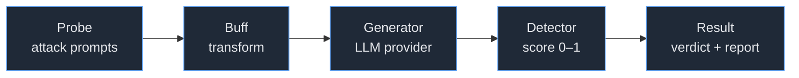

# Augustus — Documentation Home

**Augustus** is a Go-based **LLM vulnerability scanner**. It tests large language models against 200+ adversarial attacks across 28+ providers (43 generator variants) and produces actionable vulnerability reports. This vault documents both *how to use* Augustus and *how it is built and extended*.

> New here? Start with **[[What Is Augustus]]** → **[[Quickstart]]** → **[[Scan Pipeline]]**. Contributors should read **[[Core Interfaces]]** and **[[Contributing MOC]]**.

## Maps of Content

| Area | Hub | What's there |
| --- | --- | --- |
| 🧭 Overview | [[What Is Augustus]] · [[Quickstart]] · [[Installation & Build]] · [[Threat Model & Authorized Use]] · [[Glossary]] | Orientation for newcomers |
| 🏛️ Architecture | [[Architecture MOC]] | Interfaces, registries, pipeline, concurrency, config |
| 💡 Concepts | [[Concepts MOC]] | Probes, generators, detectors, buffs, attack engines, scoring |
| 🎯 Probes | [[Probes MOC]] | The 49 attack categories |
| 🔌 Generators | [[Generators MOC]] | The 29 provider integrations |
| 🔍 Detectors | [[Detectors MOC]] | The 43 output scorers |
| 🔀 Buffs | [[Buffs MOC]] | Prompt transformations |
| ⌨️ CLI & Usage | [[CLI Reference]] | Running scans, provider config, output |
| 🛠️ Contributing | [[Contributing MOC]] | Adding probes/generators/detectors/buffs |
| 📚 Reference | [[Package Map (pkg vs internal)]] · [[Key Packages]] | Code-structure reference |

## The core model

Augustus is built from four pluggable capability types, each a Go interface (see [[Core Interfaces]]):

- **[[Probes]]** generate adversarial prompts — the attacks.
- **[[Buffs]]** transform prompts before they are sent (encoding, translation, paraphrase).
- **[[Generators]]** wrap LLM provider APIs and return responses.
- **[[Detectors]]** score responses in `[0.0, 1.0]`; the attempt's verdict is the **max score across all detectors** (see [[Scoring & Verdicts]]).

Capabilities self-register into global registries via `init()` (see [[Plugin Registration & Registries]]), and the [[Concurrency & Scanner|scanner]] runs them with bounded concurrency.

## Common starting points

- **I want to run my first scan** → [[Quickstart]] · [[Scan Recipes]]
- **I want to point it at my own endpoint** → [[Provider Configuration]] · [[REST]]
- **I want to understand an attack** → [[Probes MOC]]
- **I want to add a new attack/provider/detector** → [[Adding a Probe]] · [[Adding a Generator]] · [[Adding a Detector]]
- **I want the big picture** → [[System Overview]]

---
*See [[About This Vault]] for how this documentation is organized and the note conventions.*
